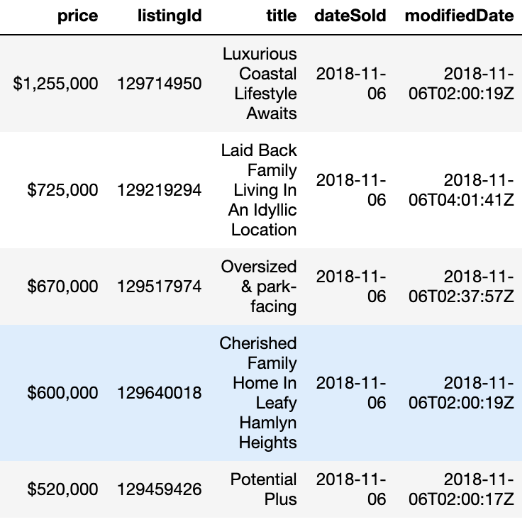
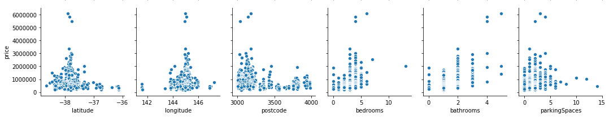

# INTRODUCTION
The purpose of this project was to determine the best machine learning model that would predict housing prices. Buying a house is something that most people will experience at least once in their life, and it is important to develop a resilient method that will help people make an informed decision in buying a house.

  

# DATASET AND APPROACH
We used Kaggle's 'Victoria Real Estate' dataset, and the following figures show the first 5 house entries with all the columns they have (1):

  

  

  

This data is recent, as the set was created around 1 year ago. Each entry has a sold date from October or November 2018, meaning that this dataset, and any models trained on it, do not reflect any market fluctuations throughout the year. 

## Data Cleaning
The original dataset has 105,120 samples. 

First, we got rid of all the features that we believe are useless for predicting house prices. The first six features are location features. To simplify the problem, we decided to use only the region feature, because it has the least number of categories (i.e. 16 of them). Then we got rid of the following features, because by common sense, they do not impact the price of a house: listingId, title, dateSold, modifiedDate.

Then we got rid of all rows with missing and unknown column entries, as a complete dataset is needed to feed it into a model.

After all the cleaning, the dataset had 99,863 samples. This is a loss of 5,257 samples, or 5% of the original data. This is a very small loss of data.

## Converting Categorical Features 

## Detecting Outliers
After cleaning the data, converting all the categorical data into to numeric data using label encoding and removing all the invalid data, we wanted to ensure that there were no outliers in our dataset. We initially did PCA on all of the numeric features excluding our labels, the price of houses, to one dimension. The new dimension, which is the compressed version of all the features, was plotted along the price of the house.

  

We next conducted PCA ignoring all the categorical data in order to ensure that the categorical data was not displaying invalid outliers.

  

Since both of the plots had the same trends, we removed the four points, which are circled in red, that were far away from the large cluster on the plots.

  

## Feature Selection

  

## Binarization

The features we ended up going with are: number of bedrooms, bathrooms, parking spaces, region, house type,  and price. There were other location features, such as latitude, longitude, postcode, and suburb, but we chose to ignore those because we felt that only one location parameter would be relevant. We also removed all non-categorical features with text in them, because that would require extenive NLP to process, which is out of the scope of the project.

Region is a categorical feature with 16 possible categories. We needed a way to turn categorical features into ordered, numerical features, because there is no natural ordering to categorical features. To handle this, we binarized the features, meaning that each category became a feature. Thus 16 extra features were added to our feature set, with each data point having only one of those features (indicated by a 1), and the rest of the features being a 0. 

House type is also a categorical feature, and there were 11 possible categories. We used the same binarization approach to handle this feature.

Overall, there were 30 features in our final dataset.

# EXPERIMENTS
How did you evaluate your approach?
What are the results?

## Overview
We tested 5 models on the dataset, with the goal of finding the best one: Ridge Regression, Decision Tree, Random Forest, Neural Network, and K-Means Clustering (unsupervised). For each model, we used 80% of the data as training data, and 20% of the data as testing data.

After runnning each model, we calculated the RMSE and the Adjusted R^2 value. The Root Mean Square error tells us how 'off' the predicted prices are from the ground truth prices. The Adjusted R^2 value tells us how good the model's prediction is compared to a model predicting the mean value of all predictions, which serves as a benchmark for the model's accuracy (Source: https://www.analyticsvidhya.com/blog/2019/08/11-important-model-evaluation-error-metrics/). We want the Adjusted R^2 value to be as close to 1 as possible. Also, we calculated the ratio between the RMSE and the range of prices in the test set as an indicator of how small the RMSE is compared the overall range of house prices avaiable. A smaller value would be another indicator of how good the RMSE is.

To ensure that the model's accuracy is not impacted by the train-test split, we used 10-fold cross validation on a shuffled version of the data to run our models. Hence, there are 10 RMSEs and 10 Adjusted R^2 values, of which we found the average of each.

## Ridge Regression

### Description

Ridge Regression aims to fit a function to the dataset such that the following error function is minimized:

The first term in this equation is the loss function, and the second term is the amount of penalty to add to the loss function. The purpose of this penalty is to prevent overfitting. Lambda is known as the regularization strength, which contributes to the penalty value. We used a set of 5 possible regularization strength values, of which we needed to choose 1: [0, 0.1, 1, 5, 10, 100, 1000]. We chose this set because it was the same one used in HW3. To find the best one, we used 10-fold cross validation on the training set. We used the Scikit Learn RidgeCV library to train the model based on the possible regularization strength values and the number of folds we wanted to use in cross validation.

### Results

The following figure is a plot of the RMSE for each fold that Ridge Regression was trained on:

  

The following figure is a plot of the Adjusted R-Squared for each fold that Ridge Regression was trained on:

  

The following numbers are some statistics we gathered for this model:

Average RMSE: 50904.29373624
Average Adjusted R-Squared: 0.48439081215876084
Average RMSE-Price-Range Ratio: 0.02220778486116286

The Average RMSE itself was pretty good, because of the low RMSE-Price-Range Ratio. However, the Adjusted R Squared value is pretty far from 1. This model took about 36 seconds to run.

## Random Forest
### Process
We wanted to determine the correct hyperparameters in order to increase the Root Mean Square Error (RMSE), so we adjusted the Minimum Samples needed in order to create a leaf. In order to ensure that we could get the highest RMSE, we varied the Minimum Samples Leaf Size from 1 to 100. We determined the optimal leaf size by looking for the point on the plot where the Training RMSE continued to decrease and the Testing RMSE started to increase when we look at plot in decreasing order of leaf size. By determining the optimal leaf size, we also reduced the chance for overfitting. Overfitting occurs when the RMSE is high for the Training data but low for the Testing data in comparison to other hyperparameter value.

  

Next, we determined the optimal max depth in order to prune our Random Forest to further decrease the chance for overfitting. Therefore, we varied the Max Depth between 1 - 100, which means that when we are at our Max Depth limit a leaf will be created instead of recursively trying to split the data further. We determined the optimal depth by finding the minimum RMSE and the corresponding Max Depth. Since the RMSE was asymptotic for both the Training and Testing datasets after the depth was greater than 20, we knew that overfitting was not occurring because of the depth.

  

Finally, we ran K-Fold cross validation with 10 folds, and we computed the RMSE, RMSE Percentage, R Squared, and time needed for execution.

  

  

Overall, the Random Forest was effective because the RMSE is quite low, 40757.9, the R Squared value, 0.669, is close to 1. The Random Forest also was very efficient as it took 10.5 seconds for K-Fold Validation with 10 folds.

# BEST MODEL
What is the best model?
How do you compare your method to other methods?

# Sources
1. https://www.kaggle.com/ruizjme/realestate-vic-sold
2. 

