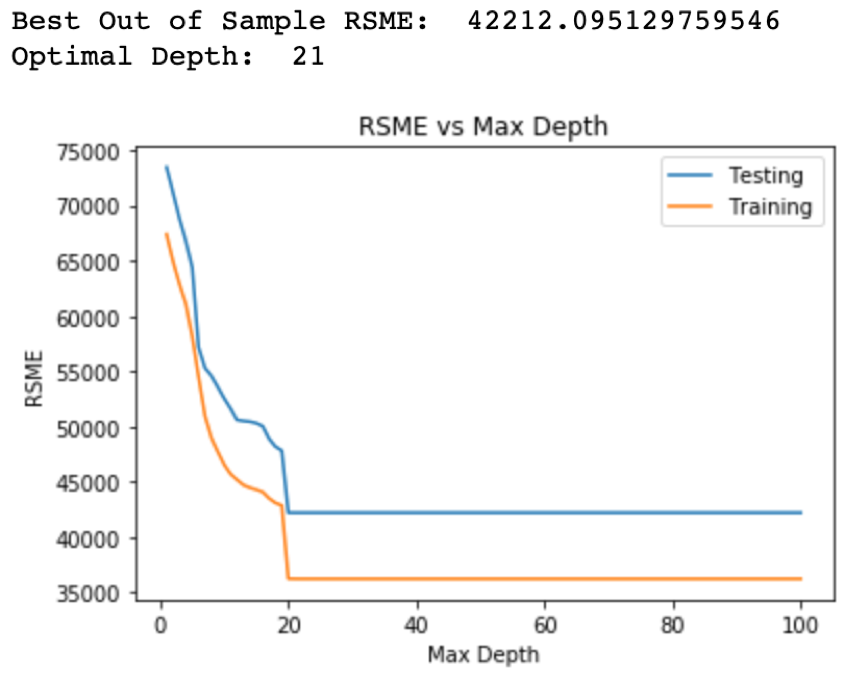
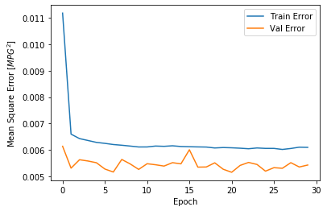

# INTRODUCTION
The purpose of this project was to determine the best machine learning model that would accurately predict house prices based on relevant features of a house. Buying a house is something that most people will experience at least once in their life, and it is important to develop a resilient method that will help people make an informed decision.

  

# DATASET AND APPROACH
We used Kaggle's 'Victoria Real Estate' dataset, and the original dataset has 105,120 samples with the following 15 columns (Ruiz):
- Street Address
- Listing Id
- Title
- Date Sold
- Modified Date
- Region
- Latitude
- Longitude
- Suburb
- Postcode
- Bedrooms
- Bathrooms
- Parking Spaces
- Property Type
- Prices

This data is recent, as the set was created around 1 year ago. Each entry has a sold date from October or November 2018, meaning that this dataset will produce a model that can be used in the near future.

After conducting research on past approaches and factors that impact house prices, we determined that the dataset contained the main features required to build a good model to predict house prices. We also saw features that could be generalized to houses in other regions.

## Data Cleaning
We decided to remove entries with missing values and other values with which we would be unable to train on. For example, some houses had a listing which only said to contact agent.

After all the cleaning, the dataset had 99,863 samples. This was a loss of 5,257 samples, or about 5% of the original data.

## Feature Selection
As there were 6 features related to location of the house in our original dataset, we decided to use the region feature as we felt that provided the most information compared to other measures like latitude and longitude. We also eliminated listingId, title, dateSold, and modifiedDate as these would provide no significant value to our model. While looking at the pairplot of the numeric features, it is evident the features that seem to provide the most information about price are number of bathrooms, bedrooms, and parking spaces. Latitude and longitude seem to not have a relationship when it comes to price and thus they were not included in the model.

  

## Converting Categorical Features into Numerical Features

The features we ended up going with are: number of bedrooms, bathrooms, parking spaces, region, house type, and price.

Region is a categorical feature with 16 possible categories. We needed a way to turn categorical features into ordered, numerical features, because there is no natural ordering to categorical features. To handle this, we binarized the features, meaning that each category became a feature. Thus 16 extra features were added to our feature set, with each data point having only one of those features (indicated by a 1), and the rest of the features being a 0.

House type is also a categorical feature, and there were 11 possible categories. We used the same binarization approach to handle this feature.

Overall, there were 30 features in our final dataset.

Insert Binalization features, and cite

## Detecting Outliers using Unsupervised Learning
We wanted to ensure that there were no outliers in our dataset. We initially did PCA on all of the numeric features, excluding our labels, to one dimension. The new dimension, which is the compressed version of all the features, was plotted along the price of the house.

  

We next conducted PCA ignoring all the categorical data in order to ensure that the categorical data was not displaying invalid outliers.

  

Since both of the plots had the same trends, we removed the four points, that were far away from the large cluster on the plots.

  

## Our New Approach
We tried adding a supervised flavor to the K-Means Clustering algorithm. The idea is that even though clusters don't have labels, we artificially added the label of an average price of houses in each cluster. This way, we would run K-Means clustering on our training set and testing set, and find the error between the average training prices in each cluster to the average testing prices in each cluster. We thought that this approach would provide us with better results, and that the average price of a cluster will be a good indicator of the price of houses that get added to the cluster in the future.

# EXPERIMENTS
How did you evaluate your approach?
What are the results?

## Overview
We tested 5 models on the dataset, with the goal of finding the best one: Ridge Regression, Decision Tree, Random Forest, Neural Network, and K-Means Clustering (unsupervised). For each model (excpent Neural Network), we used 80% of the data as training data, and 20% of the data as testing data.

After running each model, we calculated the RMSE and the Adjusted R^2 value. The RMSE tells us how 'off' the predicted prices are from the ground truth prices. The Adjusted R^2 value tells us how good the model's prediction is compared to a model predicting the mean value of all predictions, which serves as a benchmark for the model's accuracy (Srivastava). We want the Adjusted R^2 value to be as close to 1 as possible. Also, we calculated the ratio between the RMSE and the range of prices in the test set as an indicator of how small the RMSE is compared the overall range of house prices avaiable. A smaller ratio would be another indicator of how good the RMSE is.

To ensure that the model's accuracy is not impacted by the train-test split, we used 10-fold cross validation on a shuffled version of the data to run our models. Hence, there are 10 RMSEs and 10 Adjusted R^2 values, of which we found the average of each.

## Ridge Regression

### Description

Ridge Regression aims to fit a function to the dataset such that the following error function is minimized:

  

We used a set of 5 possible regularization strength values (i.e. lambdas), of which we needed to choose 1: [0, 0.1, 1, 5, 10, 100, 1000]. We chose this set because it was the same one used in HW3. To find the best one, we used 10-fold cross validation on the training set. We used the Scikit Learn RidgeCV library to train the model based on the possible regularization strength values and the number of folds we wanted to use in cross validation.

### Results

The following figure is a plot of the RMSE for each fold that Ridge Regression was trained on:

  

The following figure is a plot of the Adjusted R-Squared for each fold that Ridge Regression was trained on:

  

The following numbers are some statistics we gathered for this model:

Average RMSE: 50971.496987372266
Average Adjusted R-Squared: 0.4824538990276121
Average RMSE-Price-Range Ratio: 0.021861103433063488

The Average RMSE itself was pretty good, because of the low RMSE-Price-Range Ratio. However, the Adjusted R Squared value is near 0.5, so it's not obvious whether it's good or not. This model took 30.78096890449524 to run for 10 folds.

## Random Forest
### Process
We wanted to determine the correct hyperparameters in order to increase the Root Mean Square Error (RMSE), so we adjusted the Minimum Samples needed in order to create a leaf. In order to ensure that we could get the highest RMSE, we varied the Minimum Samples Leaf Size from 1 to 100. We determined the optimal leaf size by looking for the point on the plot where the Training RMSE continued to decrease and the Testing RMSE started to increase when we look at plot in decreasing order of leaf size. By determining the optimal leaf size, we also reduced the chance for overfitting. Overfitting occurs when the RMSE is high for the Training data but low for the Testing data in comparison to other hyperparameter value.

  

Next, we determined the optimal max depth in order to prune our Random Forest to further decrease the chance for overfitting. Therefore, we varied the Max Depth between 1 - 100, which means that when we are at our Max Depth limit a leaf will be created instead of recursively trying to split the data further. We determined the optimal depth by finding the minimum RMSE and the corresponding Max Depth. Since the RMSE was asymptotic for both the Training and Testing datasets after the depth was greater than 20, we knew that overfitting was not occurring because of the depth.

  

Finally, we ran K-Fold cross validation with 10 folds, and we computed the RMSE, RMSE Percentage, R Squared, and time needed for execution.

  

  

Overall, the Random Forest was effective because the RMSE is quite low, 40757.9, the R Squared value, 0.669, is close to 1. The Random Forest also was very efficient as it took 10.5 seconds for K-Fold Validation with 10 folds.

## Decision Tree
### Process
Similar to the Random Forest Model, we wanted to determine the correct hyperparameters for the Decision Tree model to get the lowest Root Mean Square Error (RMSE) and to reduce overfitting. We applied different Minimum Samples Leaf Size to the model that ranged from 1 to 50 number of leaves. Just like in Random Forest, we determine the most optimal number of leaves by searching in decreasing order of leaf size to find the point in the plot where the Training RMSE decreased as the Testing RMSE increase. Finding the optimal number of leaves also, reduced the probability that overfitting occurs within our model.

  

Additionally, we found the most optimal Max Depth for our Decision Tree model with further reduced the chance of overfitting. We tested different depths that ranged from 1 to 100. We found the optimal Max Depth by searching for the point that had the lowest RMSE. When the depth is greater than 20, the Training and Testing datasets displayed no change in RMSE which guaranteed that there was no overfitting in the model.

  

After optimizing our parameters, we ran a 10-fold cross validation and computed the model’s RMSE, RMSE Percentage, R Squared, and time needed for execution.

  

  

Overall, Decision Trees has a low RMSE of 42136.6 and has a R Squared value of 0.644. Additionally, the Decision Tree model took approximately 24.9 seconds to find the optimal Leaf Size and Max Depth and to run the cross validation.

## Neural Network
### Process
We also attempted to use a neural network to model our problem. The dataset was normalized before by using a min-max scaler. The archictecture of the final neural network is as follows:

  

The optimal model has 3 hidden layers made of 64 nodes and droupout layers dropping out 50% of the parameters after each hidden layer. The activation function used was Relu.

Hyper parameter tuning was used to formulate the parameters in the neural network. All the possible parameters include number of nodes, number of hidden layers, activation function, and number of epochs. Parameters chosen reduced validation and training set Mean Square Error. Here are the results of the model with varying amount of hidden layers:
#### 1 Hidden Layer

  

#### 2 Hidden Layers

  

#### 3 Hidden Layers

  

#### 4 Hidden Layers

  

The values continued to degrade past 4 hidden layers which was why we decided 3 hidden layers would be best.
Here is a 3 layer architecture with changing activation functions:
#### Tanh Activation Function

  

#### Sigmoid Activation Function

  

The Tanh activation function was the 2nd best while the sigmoid function seems to be performing the worst.
The validation set was 10% of the data and was shuffled after each of the 30 epochs. The final RMSE value for this model was 0.07 and gave a R^2 of 0.47.

## K-Means Clustering
### Process
To perform K-Means Clustering on our dataset, we first created clusters based on the training data’s features, excluding price. Next, we took all the data points in the same cluster and averaged their prices. After finding the average price of each training cluster, the test data was assigned clusters based on the model that was generated by the training data. We identified which one of the clusters each test data point fell into and set their predicted label/price to be the average price represented by the cluster.

To determine the correct hyperparameters to minimize the Root Mean Square Error, we varied the number of clusters we split our data into from 1 to 100 (call this variable k). For each k, we calculated the RMSE to identify the optimal number of clusters.

  

From analyzing the graph above, we found the optimal number of clusters to be 73. With this optimal number of clusters, we ran K-Fold cross validation with 10 folds and computed the RMSE, RMSE percentage, R Squared, and time needed for execution.

  

  

In all, K-means Clustering turned out to be a bad model for our dataset as the RMSE is 381001.587 and the R Squared value is -9536.015. The time it took to run K-Means Clustering was 1427.653 seconds.

# BEST MODEL
What is the best model?
How do you compare your method to other methods?

  

  

  

# Works Cited

Ruiz, Jaime. “Victoria Real Estate.” Kaggle, Kaggle, https://www.kaggle.com/ruizjme/realestate-vic-sold.

Srivastava, Tavish. “11 Important Model Evaluation Metrics for Machine Learning Everyone Should Know.” Analytics Vidhya, 6 Aug. 2019, www.analyticsvidhya.com/blog/2019/08/11-important-model-evaluation-error-metrics/.

